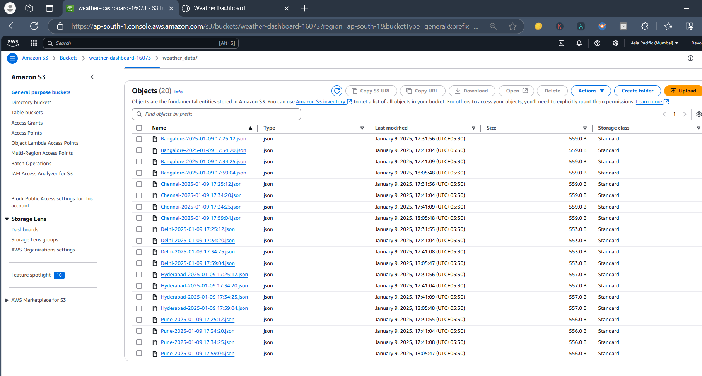
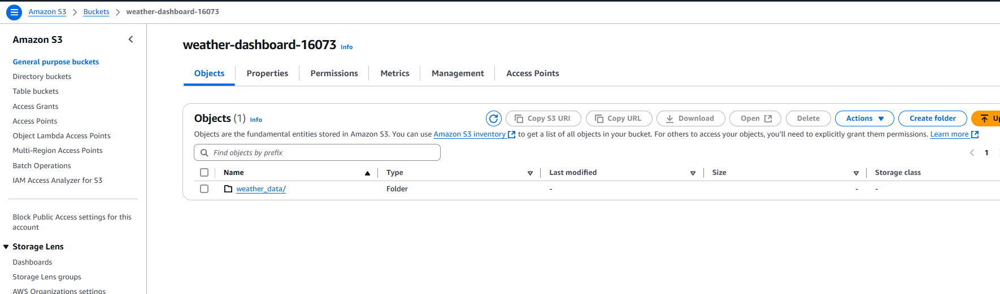
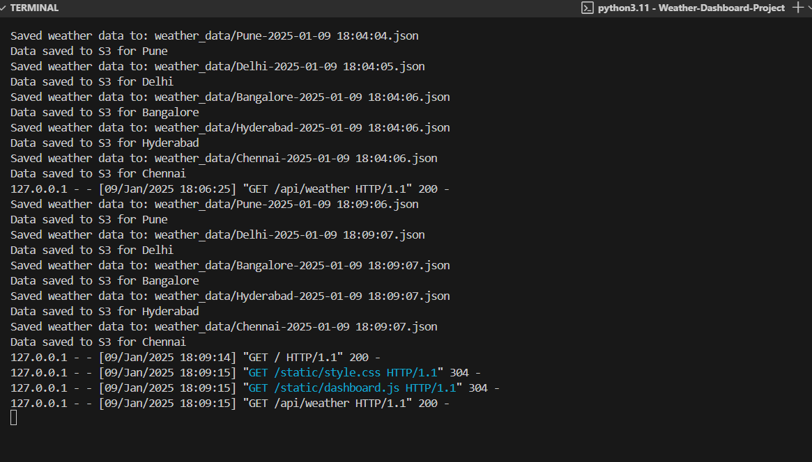
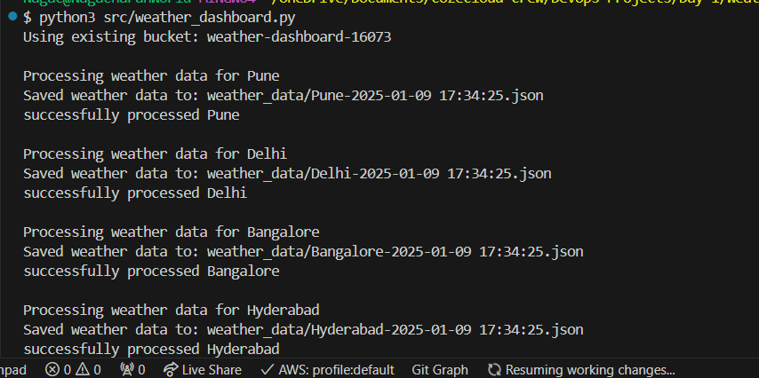
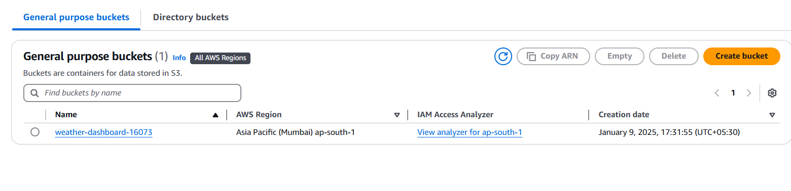
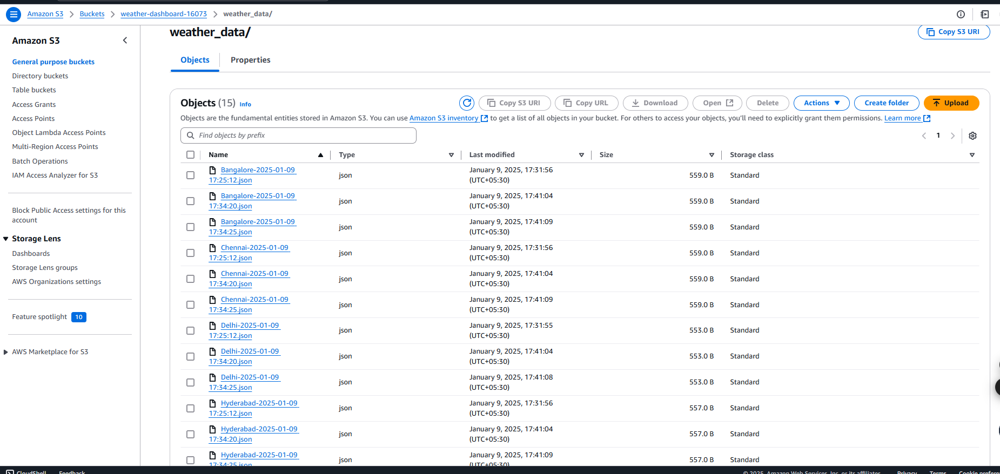
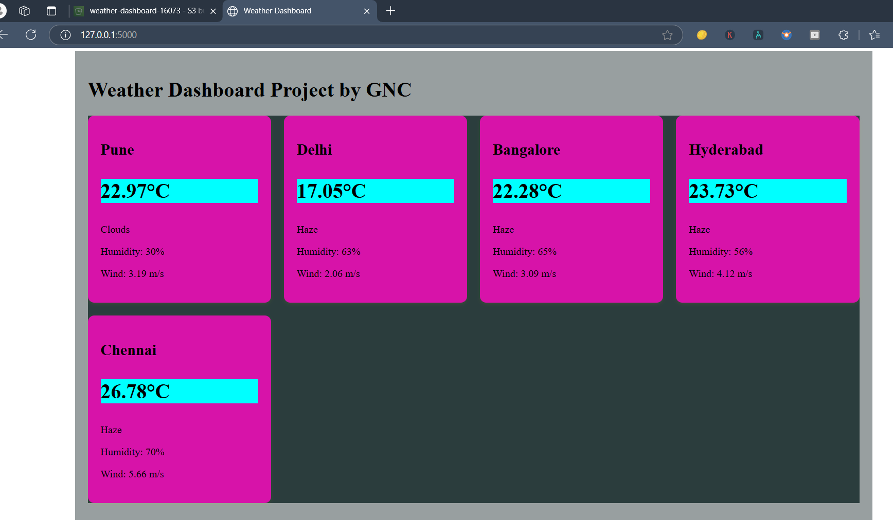
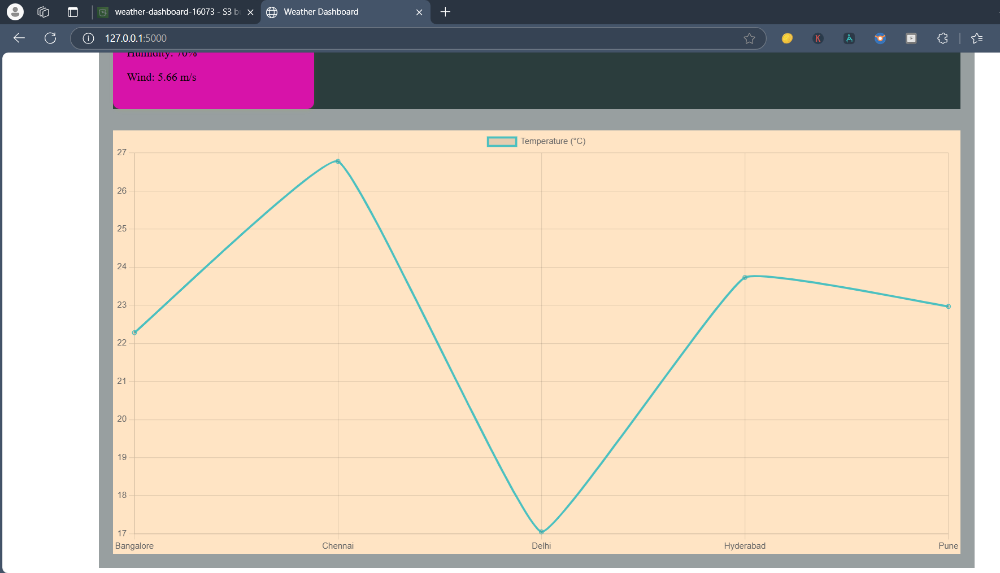

Weather Dashboard Documentation
1. Project Structure
```
weather-dashboard/
├── src/
│   ├── app.py
│   ├── weather_dashboard.py
│   ├── static/
│   │   ├── style.css
│   │   └── dashboard.js
│   └── templates/
│       └── index.html
├── .env
├── requirements.txt
└── README.md
```
## 2. Setup Instructions

# Weather Dashboard Project

Real-time weather monitoring system with AWS S3 integration and web dashboard.

## Prerequisites
- Python 3.8+
- AWS CLI configured
- OpenWeather API key

## Installation
```bash
git clone <repository-url>
cd weather-dashboard
pip install -r requirements.txt
```
Environment Setup

create `.env` file :
```
OPENWEATHER_API=your_api_key
AWS_BUCKET_NAME=your_bucket_name
```

Running an application `python src/app.py`

Access at `http://localhost:5000`


#### 3. Dependencies
```python
flask==2.0.1
boto3==1.26.137
python-dotenv==1.0.0
requests==2.31.0
```
## 4. Features
Real-time weather monitoring
AWS S3 data storage
Web dashboard with charts
Multi-city support
Background data collection


#### 6. Architecture
```markdown
# System Architecture

## Components
1. Weather Data Collector (weather_dashboard.py)
   - Fetches data from OpenWeather API
   - Stores data in AWS S3
   
2. Web Dashboard (app.py)
   - Flask web server
   - Real-time updates
   - Data visualization

## Data Flow
1. Background thread fetches weather data
2. Data stored in S3 bucket
3. Frontend polls API endpoint
4. Chart.js visualizes data


#### 8. Deployment
```markdown
# Deployment Guide

## AWS Setup
1. Configure AWS CLI
2. Create S3 bucket
3. Set appropriate permissions

## Production Deployment
```bash
# Set environment variables
export FLASK_ENV=production
export FLASK_APP=src/app.py


#### 9. Maintenance
```markdown
# Maintenance Guide

## Log Monitoring
Check AWS CloudWatch for S3 operations

## Data Cleanup
Implement data retention policy:

```python
def cleanup_old_data():
    # Delete data older than 30 days
    pass
```


[openweathermap api website](https://openweathermap.org/api)
















